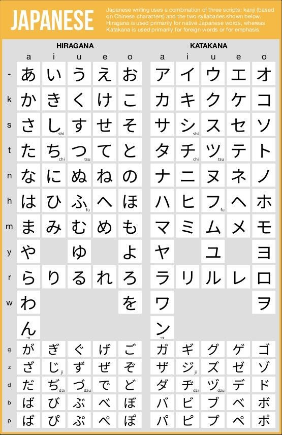
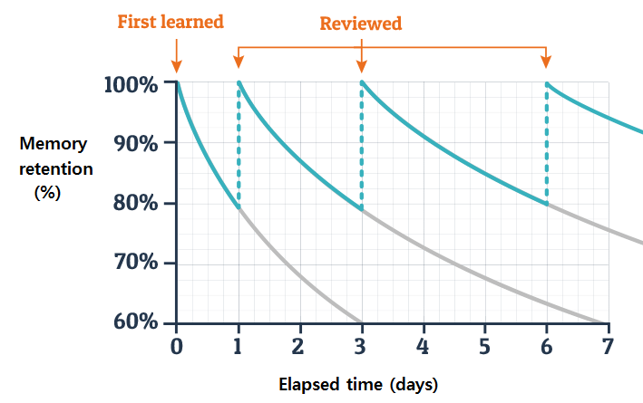
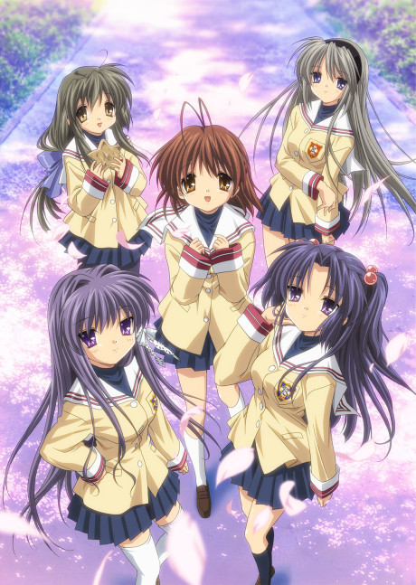
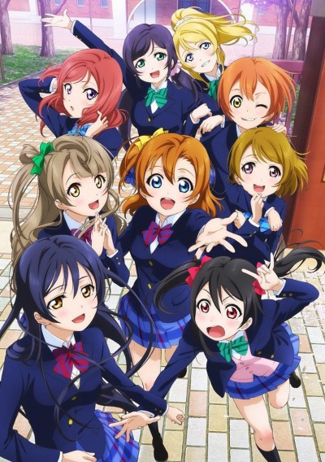
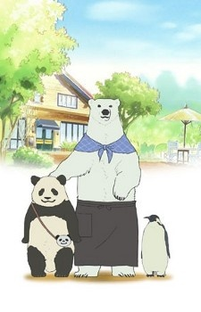
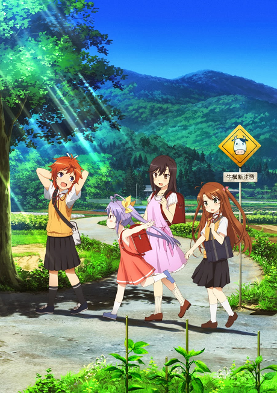
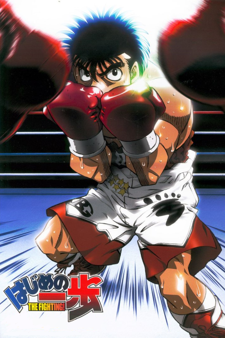

## About This Guide

There are plenty of Japanese guides on the internet, and following pretty much any of them can get you to fluency as long as you put in enough hours. With that being said, most guides lack depth and detail. Here, we're going to get a bit more granular.

Any reasonable Japanese guide will teach you that immersion is key, and that you need to put in thousands of hours of immersion + SRS[^SRS]. But what they often fail to mention is what you should immerse in, and when. This isn't necessarily an issue, as immersing in things you're interested in is a great approach. However, some people need more structure to their learning, with measurable metrics to see how far they've come.

The point of this guide is to provide that structure, so you can follow simple steps, and know exactly how far along in your Japanese journey you are -- as well as how far you have left to go. By the end of this journey you will reach a level where you can comfortably watch most anime, read casual novels without much difficulty and immerse in virtually whatever your heart desires. At that point, you'll be at a level where you won't really need guidance on what to do anymore.

If you have any questions or things that are unclear, don't hesitate to ask in the Discord server! Alternatively, [UsagiSpoon's day-by-day guide](https://learnjapanese.moe/routine/ "https://learnjapanese.moe/routine/") for your first 30 days of learning Japanese is a good resource as well.

## How Perdition Measures Progress

Before talking about the specifics, I want to give a brief overview of how this server helps people to measure their Japanese progress. We believe that your Japanese ability has a linear relationship with the number of characters you consume. In other words, the more Japanese characters you immerse in, the better you will be. It's as simple as that, more > less.

Because characters are easily measurable, Eminent created a bot that will let you track how much you've read/watched. As you log more characters with the bot, you'll get new roles to show your progress. Think of these as "checkpoints" in your journey.

### Our role system looks like this:

- 平民 - 100,000 characters

- 男爵 - 500,000 characters *(must pass quiz 1)*

- 子爵 - 1,000,000 characters

- 伯爵 - 2,000,000 characters

- 侯爵 - 3,500,000 characters

- 公爵 - 5,000,000 characters *(must pass quiz 2)*

- 大公 - 7,500,000 characters

- 王様 - 10,000,000 characters

- 天皇 - 15,000,000 characters

- 地仙 - 25,000,000 characters *(must pass quiz 3)*

- 天仙 - 50,000,000 characters *(must pass quiz 4)*

- 上手 - 100,000,000 characters *(must pass quiz 5)*

> The roles with quizzes on them can be seen as the major checkpoints, where:
> 
> - 男爵 is ~N4ish
> - 公爵 is ~N1ish (although the actual N1 test will test things other than vocab)
> - 地仙 is fluent
> - 天仙 is beyond native level (in vocab alone, native skill level cannot be measured solely by vocab count)
> - 上手 is for literal gods

We've created and collected several tools to make tracking characters nearly 0 effort, so you don't have to waste any time trying to figure out how many characters you've consumed. In short, you drag your sub file into [Eminent's Subtitle Character Counter](https://cademcniven.com/subtitleCharacterCounter.html) , and log it with the bot. For more information, check out the [#immersion-tracking](https://discord.com/channels/730440689099210786/986000654621368390/986002348323250186 "https://discord.com/channels/730440689099210786/986000654621368390/986002348323250186") channel in the Discord server.

## How This Guide Is Structured

The curriculum we've prepared can take you from knowing absolutely nothing to being able to read/watch (almost) anything you want in just a *few* steps. Depending on how much of the curriculum you choose to complete, you should finish with somewhere between 1-3 million characters consumed.

- [Step 1]({{ref}}#step-1--fundamentals) will teach you the big picture of how to learn Japanese, introduce you to the alphabets, and get you a solid base of vocabulary so that you can start immersing asap.
- [Step 2]({{ref}}#step-2--anime-deep-dive) will have you deep dive a few anime series. By the end of this step you should be able to watch and enjoy basically any anime you want.
- [Step 3]({{ref}}#step-3--novels) will have you read a few novels or VNs. By the end of this, you should be able to read LNs well enough to enjoy them. I won't claim that you'll be able to read anything and enjoy it, since the difficulty of written media varies wildly, but it won't be out of reach.

> By finishing step 2 you'll receive an elementary graduate role.

> By finishing step 3 you'll receive an advanced graduate role.

We understand that not everyone is going to be interested in all kinds of media. Therefore, if you have no interest in novels / VNs[^VNs], feel free to stop after [step 2]({{ref}}#step-2--anime-deep-dive). If you have no interest in anime, feel free to skip to [step 3]({{ref}}#step-3--novels).

## Step 1 | Fundamentals

### Step 1-A | Introduction To Immersion

To start off, you'll need to get on board with what immersion learning is, and why it's important. Otherwise, everything else past this might not make a lot of sense. As a primer, we recommend watching [this](https://www.youtube.com/watch?v=J_EQDtpYSNM "https://www.youtube.com/watch?v=J_EQDtpYSNM") video. Alternatively, if you don't want to spend 14 minutes on a YouTube video, you can just believe us that it's super important to surround yourself with language even during your learning process, despite a relatively low comprehension rate.

### Step 1-B | Kana

14 minutes later and you've already finished a step! If you keep up this pace you'll finish everything by the end of the day! [^joke] 

Now that you know the basics of immersion learning, the first bit of actual Japanese learning you'll need to do is learn kana, which constitutes 2 of the 3 Japanese writing systems.

This shouldn't take particularly long, but for some people (myself included), this is actually one of the most difficult steps of learning Japanese, due to how novel it is if  you have no prior knowledge.

We recommend learning kana as a 4 step process:

1. Watch this video: [Learn ALL Hiragana in 1 Hour - How to Write and Read Japanese - YouTube](https://www.youtube.com/watch?v=6p9Il_j0zjc "https://www.youtube.com/watch?v=6p9Il_j0zjc")
2. Review hiragana with [freerice.com/hiragana](https://play.freerice.com/categories/hiragana) until you feel like you have a pretty solid grasp of them (you don't have to be perfect).
3. Watch this video: [Learn ALL Katakana in 1 Hour - How to Write and Read Japanese - YouTube](https://www.youtube.com/watch?v=s6DKRgtVLGA "https://www.youtube.com/watch?v=s6DKRgtVLGA")
4. Review katakana with [freerice.com/katakana](https://play.freerice.com/categories/katakana)

If you don't like freerice, feel free to use something like [kana.pro](https://kana.pro/), or really any site that lets you quiz kana. However, the freerice.com quizzes will donate 10 grains of rice to those in need for every kana you review -- so you may as well do a good deed while you learn. 🙂

Alternatively, you can download [this Anki deck](https://cdn.discordapp.com/attachments/381586349993623553/1076832446047326289/Kana.apkg "https://cdn.discordapp.com/attachments/381586349993623553/1076832446047326289/Kana.apkg") and learn kana that way. If you're not familiar with Anki, don't panic, just have a look at [Step 1-C]({{ref}}#step-1-c--anki).

Ultimately, how you learn kana is up to you. If needed, feel free to reference some kana charts, such as this:

_Kana chart_

### Step 1-C | Anki

For this step, all you'll need to do is download (and optionally, set up) Anki. You'll want to download the latest version [here](https://apps.Ankiweb.net/ "https://apps.Ankiweb.net/").

Anki is based on spaced repetition, which is basically a fancy term for smart-flashcards.

SRS works by showing you a flashcard just before your brain forgets it, which trains your brain to hold on to information much longer than if you simply kept reviewing the flashcards over and over again. This also has the benefit of taking less time, since you don't have to see every flashcard every day.

To illustrate this point, have a look at the following graph:

_Ebbinghaus' forgetting curve and review cycle [^forgetting-curve]_

As illustrated, in an optimal model, with every repetition, your brain will retain the new information longer than the previous time.

For example, you may first see a flashcard after 1 day, then not see it again for 4 days, then not again for 8 days, etc.

The role of Anki in your learning is to minimise the number of repetitions necessary to learn a new word, and maximise your retention of that new information so that you'll recognise it when you see it in immersion.

> Anki works fine out of the box, but if you want to tweak it a bit to be more optimal, feel free to check out [this guide](https://cademcniven.com/posts/20210410/ "https://cademcniven.com/posts/20210410/") by Eminent . The [Anki Manual](https://docs.Ankiweb.net/ "https://docs.Ankiweb.net/") is also a worthwhile read. If you're particularly interested in SRS, you can also read up more on the concepts on the [Supermemo Wiki](https://www.supermemo.wiki/en/supermemo#spaced-repetition "https://www.supermemo.wiki/en/supermemo#spaced-repetition").

I'd recommend sticking with 20 new cards per day for your first 2 weeks at least , so you can see what the workload is like. If you can manage more, bump it up. If not, stay at 20. If you do less than 20 in the beginning, you're going to cripple your progress. It's fine to do less later on once you have a solid foundation of vocab, but when you're just starting, a low number of new cards per day can actually slow your progress to the point that you quit. It is, however, important to note that if you truly cannot manage 20 a day, then lowering it to 15 or even 10 is better than 0, but don't forget that the more cards you do, the faster you'll progress. You're doing this for yourself after all.

For more info on how many cards to do, see [this article](https://cademcniven.com/posts/20211119/ "https://cademcniven.com/posts/20211119/") by Eminent.

### *Step 1-D | Kanji Lego (Optional)*

This step is optional, but the majority of people need it.

Other than hiragana and katakana, Japanese has a third set of characters called kanji (plural is also kanji). These are the hard ones. There are several thousand that you'll need to be able to recognise eventually (~3500).

However, unlike kana, kanji should primarily be learned through learning vocab. For example, suppose you see the word 見る (miru, to see) for the first time, and you don't know the character 見. If you just learn the word 見る, you've also learned the character 見, so there's not much need for kanji study independent of vocab study.

With that being said, many people who jump straight into vocab find it extremely difficult to remember words since they don't know any kanji. Furthermore, without previous exposure to non-latin writing systems, it is very easy to overlook kanji as noise when starting out. To illustrate this, read the following sentence:

> The population of China is 1,453,916,919, which is about 4 times the population of The United States.

You most likely skipped the number altogether, or just read "1.4 billion" and moved on. If you haven't trained to recognise kanji as ***characters*** instead of ***random squiggles*** in a sentence, it can be very difficult to learn them. To combat this, we recommend going through the [RRTK450 Anki deck](https://mega.nz/file/2SJiWC4b#hL98qtC_hiLlQDg0LqVJoqD2-5ywT2Nwd4kjROY_KwQ "https://mega.nz/file/2SJiWC4b#hL98qtC_hiLlQDg0LqVJoqD2-5ywT2Nwd4kjROY_KwQ"), which covers the 450 most common kanji. The main goal of this step is to make you familiar with common kanji "building blocks", so you no longer see them as squiggles. Try to learn the general meaning of the kanji, but for the most part, a rough idea of what it's associated with is good enough.

> "B- But! Hurr-durr I know people who learned Japanese without doing something like this!"

It is entirely possible to learn Japanese without the this step. Some people will tell you it's a waste of time; and they aren't necessarily wrong, depending on how well you can differentiate between kanji. Ultimately, it is up to you. Completing the deck doesn't take too long, so at worst, you waste a bit of time;  at best, you save yourself a lot of headache.

### Step 1-E | Basic Vocab

This is the last part of step 1 and also the longest part (and for many people, the hardest part of learning the entire language). During this step you'll be going through the [Tango N5 omega deck](https://mega.nz/file/uHxWjTaC#X2hBAYg_cLttQmUvJQWmlk8QbnQtIIoXH7xU5DuDFeU) to learn ~1000 words and familiarise yourself with basic sentence structure. This step builds the foundation of your vocab, which will let you get into mining (making flashcards from immersion) much easier.

If you do 20 new cards per day, it should take you ~50 days to finish this deck. Feel free to do more cards than that if you want, the faster you can get past this stage, the better, but doing less is going to be seriously slow progress.

Also, I'll warn you ahead of time, learning vocab might seriously suck in the beginning. Words might feel like they're impossible to remember, and you'll probably get more than 1 headache. This is normal, everyone goes through it, just keep pushing forward and you'll be fine. If you are not used to studying anymore, it takes a few days or even weeks to get back into absorbing information, so be patient with yourself and don't give up.

Many people, myself included, have spent a lot of time looking for easier, more effective alternatives, and there are straight up none. If you see an alternative that seems easier or better, I can 100% promise you it's not. There's no way to get fluent without just putting in the time and effort.

The good news is, vocab gets exponentially easier as you learn more new words, so after you do it long enough, it will take almost no effort to learn new words.

When you complete this step you'll receive the **@初心者** role.

### Step 1-F | Grammar

Doing Anki won't take up 100% of your day, so there's a couple things you'll want to do during the couple of months you spend getting through the tango deck.

The first thing is to get a very basic grasp on some grammar.

There are 4 beginner grammar resources that are all good, with some important differences. In no particular order:

- [Tae Kim's Grammar Guide](https://guidetojapanese.org/learn/ "https://guidetojapanese.org/learn/") is the most popular grammar guide, but also probably the most controversial **(has multiple inaccuracies)**
- [Pomax's Grammar](https://pomax.github.io/nrGrammar/ "https://pomax.github.io/nrGrammar/") is a guide that's **much more detailed** (and more correct) than Tae Kim, **but uses some linguistics** terms that might be slightly difficult for some people
- [Imabi](https://www.imabi.org/ "https://www.imabi.org/") is the **most complete** free grammar guide (as far as English guides go), but also uses the **most difficult language**, so it can be hard to understand. It also goes into way more detail than what's necessary — or even useful — for a beginner. If you enjoy grammar, go with Imabi; avoid it otherwise. 
- [Cure Dolly's guide](https://www.youtube.com/playlist?list=PLg9uYxuZf8x_A-vcqqyOFZu06WlhnypWj "https://www.youtube.com/playlist?list=PLg9uYxuZf8x_A-vcqqyOFZu06WlhnypWj") is the only YouTube guide on this list. This is **probably the easiest to understand** out of all 4, but this resource is also **very divisive because of cure dolly's voice**. If you like the explanations but can't stand the voice, turn on subtitles, mute the video, and set playback speed to 2x. Thank me later.

Something important to note about this phase: your goal is, unintuitively, not to learn grammar. Kind of.

Grammar is the most abstract part of a language, and therefore the most difficult thing to memorise in a vacuum. It is a herculean task to try to memorise grammar that you've never seen in immersion before. That's why we don't recommend it.

There's no point in learning every grammar point by heart when you've never even seen them used before. Instead, the point of this phase is to acquaint yourself with basic grammar, that way you'll recognise it when you do see it. This doesn't mean you'll definitely know what it means when you see it later, but at least you should be able to go *"oh, that's not vocab, that's grammar"*, and then be able to go look it up.

You should also gain a basic familiarity with how sentences are generally built and structured from this process, so basic sentences should make at least some sense, assuming you learn the words used in them.

**You should finish reading most of the grammar guide of your choice by the time you finish the Tango N5 deck.**

### *Step 1-G | Pitch (Optional)*

Another thing to do while working through tango is to train your ear to be able to hear pitch.

I won't go too much into this subject because it can get overwhelming quickly, but you should know that while English uses *stress accent*, Japanese, uses something called *pitch accent*. This isn't something difficult per-se, but your ear needs to listen to different details than it would in English to derive meaning.

To train your ear for this, the best way is to use [this quiz](https://kotu.io/tests/pitchAccent/perception/minimalPairs "https://kotu.io/tests/pitchAccent/perception/minimalPairs"). I know registration is a bother, but you'll just have to deal with it. You'll want to do it daily — even just 5 minutes — until you can get like 98%-ish correct. This step is absolutely not necessary, but it can make a pretty significant difference in the long run.

> Consider this example: 
> 
> Say the word "Colorado" out loud. If you said it correctly, there should be a stress on the "a", like colorAdo. Now try saying it with the stress somewhere else: COlorado, coLOrado, coloraDO. Notice how all of those sound so wrong that it would be comical if someone said that in an actual conversation. It doesn't necessarily hurt comprehension, but it does make you sound funny.

If you can't perceive pitch accent, you'll make mistakes like that when you try to speak in the future. For most people, they end up having to go back and "re-learn" every single word they know in order to learn it with the correct pitch. However, if you can identify pitch correctly from the beginning, then you know how it's supposed to sound when you first learn it, and then you won't have those problems at all.

That, of course, is a bit of an oversimplification of a fairly complex subject, but just know that spending a few minutes per day doing this in the beginning will pay dividends.

### Step 1-H | Immersion *(Optional)*

One last thing you might want to do while working through Tango is immerse.

Note that there is a difference between mining and immersion. Mining, which you'll do in [step 2]({{ref}}#step-2--anime-deep-dive), is to immerse while making flashcards for words you don't know. Immersion on the other hand just refers to the consumption of native content.

During this phase, your comprehension of native content is going to be absolutely abysmal. That said, that doesn't mean you won't benefit from doing it. Fluency is basically the product of focus (or intensity) and time. It is impossible to achieve fluency in Japanese without spending thousands of hours immersing, so you better start asap.

It should be noted, however, that for immersion to really provide significant benefits, it needs to be at least somewhat comprehensible. In fact, the more comprehensible it is (<100%), the more you'll benefit from it. That is, someone with 99% comprehension will learn more than someone with 50% comprehension.

Pre-N5, your comprehension will be very low, which means your immersion gains will be pretty minimal. This is why we generally recommend spending most of your time going ham on Anki during this phase, or on the other step 1 items, like grammar.

If you're interested in the subject of how comprehension and context plays in a role in language acquisition, check out [this article](https://cademcniven.com/posts/20220129/ "https://cademcniven.com/posts/20220129/") by Eminent. 

For the immersion you do during this phase, here are some ideas to get started:

- Perditio has a [ranked spreadsheet](https://docs.google.com/spreadsheets/d/1MiTqb5zJeGNjv2bzWPdwlfmsprN6E7LSM1flVogzhDw/edit#gid=0 "https://docs.google.com/spreadsheets/d/1MiTqb5zJeGNjv2bzWPdwlfmsprN6E7LSM1flVogzhDw/edit#gid=0") for vtuber clips channels, so if you're into vtubers, you can pretty much just spam as many of these videos as you possibly can.
- You can also just watch full streams of vtubers, [Okayu](https://www.youtube.com/channel/UCvaTdHTWBGv3MKj3KVqJVCw "https://www.youtube.com/channel/UCvaTdHTWBGv3MKj3KVqJVCw") could be a good place to start because she enunciates very well. I should mention, raw streams will probably be less comprehensible than clips, because there's no subtitles.
- [Comprehensible Japanese](https://www.youtube.com/c/ComprehensibleJapanese "https://www.youtube.com/c/ComprehensibleJapanese") makes really easy videos specifically aimed for beginners. They have a **complete beginners* playlist that's even easier than their normal videos. If you can stomach it, it can be worthwhile to just watch one of their videos on loop like 10 times until all the words start to really sink in, before moving on to the next video and doing the same thing.
- [Learn Japanese with Noriko](https://www.youtube.com/c/LearnJapanesewithNoriko "https://www.youtube.com/c/LearnJapanesewithNoriko") is a really great podcast for beginners
- [Learn Japanese Through Story](https://www.youtube.com/playlist?list=PLJov1NnDE_N_92MtmRyQknjavXa1oLSuM "https://www.youtube.com/playlist?list=PLJov1NnDE_N_92MtmRyQknjavXa1oLSuM") might be more engaging than the other options

## Step 2 | Anime Deep Dive

### How Step 2 Works

For step 2 you'll be performing a deep dive on several anime series. We've chosen these series based on a number of factors, such as:

- Personal experience watching them as beginners
- Referencing the experience of respected immersion learners
- Series length, genre, and domain overlap[^domain]

After that process, we came up with 5 starter anime that we believe are extremely useful for beginners (soon to be fluent :)). These series are:

1. Clannad
2. Polar Bear Cafe
3. Love Live! School Idol Project
4. Non Non Biyori
5. Hajime no Ippo

> If you complete 2 of these shows, you'll receive the **@初級者-底辺** role. 
> 
> If you complete 3 of these shows, you'll receive the **@初級者-中辺** role. 
> 
> If you complete all of these shows, you'll receive the **@初級者-上辺** role.

These anime are sorted, more or less, in order of difficulty (where 1 is the easiest, and 5 is the hardest). In general, *Clannad*, *Polar Bear Cafe* and *Love Live!* are all perfectly valid choices for a first watch.

I would recommend watching at least 1 of those anime before watching Non Non Biyori.

I would recommend watching at least 2 of those anime before watching Hajime no Ippo.

### How To Deep Dive

For step 2, you'll be performing a "deep dive" on a couple of anime series. A deep dive refers to watching a show while making flashcards for every single word you don't know.

> To do this, you'll want to follow the setup/workflow described in [Eminent's Guide](https://cademcniven.com/posts/20210703/ "https://cademcniven.com/posts/20210703/").

For your first deep dive, you'll most likely end up with thousands of flashcards. This may seem daunting, but if you stick with it you'll be astonished by how much better your comprehension is by the end of it.

If you're interested in knowing more about the mechanisms of why this process is so beneficial, I'd recommend familiarising yourself with what refold calls [*domains*](https://refold.la/roadmap/stage-2/a/domains "https://refold.la/roadmap/stage-2/a/domains").

In short, every genre will have a pool of vocab it draws from. If you watch other shows in the same genre, you'll likely encounter similar vocab. This is why slice of life is recommended for beginners, as there's very little vocab specific to certain domains, like sci-fi, politics, etc.

However, this idea also applies to individual series. Or in other words, every series will have its own unique pool of vocab. While shows of a similar genre will have a lot of vocab overlap, there will also be a lot of vocab unique to each series.

This is exactly why every anime in our curriculum is at least 50 episodes long. As a beginner, it's much more beneficial to deep dive long series. That way you can get extremely high comprehension in that specific series' domain; as opposed to watching short anime, hopping from domain to domain each series.

If you're following [Eminent's Guide](https://cademcniven.com/posts/20210703/ "https://cademcniven.com/posts/20210703/") that was linked above to setup Anki and your cards, then you will learn the mined words based on their frequency. This means you should mine every single unknown word you come across, the rest will be taken care of automatically.

> You can find additional frequency lists [here](https://drive.google.com/drive/folders/1g1drkFzokc8KNpsPHoRmDJ4OtMTWFuXi "https://drive.google.com/drive/folders/1g1drkFzokc8KNpsPHoRmDJ4OtMTWFuXi")

### Recommended shows

#### Clannad

{: .left}

[MAL](https://myanimelist.net/anime/2167/Clannad "https://myanimelist.net/anime/2167/Clannad"), [AniList](https://anilist.co/anime/2167/Clannad/ "https://anilist.co/anime/2167/Clannad/")

[Subs for Clannad](https://kitsunekko.net/dirlist.php?dir=subtitles%2Fjapanese%2FClannad%2F "https://kitsunekko.net/dirlist.php?dir=subtitles%2Fjapanese%2FClannad%2F")

[Subs for Clannad Movie](https://kitsunekko.net/dirlist.php?dir=subtitles%2Fjapanese%2FClannad++Movie%2F "https://kitsunekko.net/dirlist.php?dir=subtitles%2Fjapanese%2FClannad++Movie%2F")

[Subs for Clannad: After Story](https://kitsunekko.net/dirlist.php?dir=subtitles%2Fjapanese%2FClannad_After_Story%2F "https://kitsunekko.net/dirlist.php?dir=subtitles%2Fjapanese%2FClannad_After_Story%2F")

 

#### Love Live!

{: .left}

[MAL](https://myanimelist.net/anime/15051/Love_Live_School_Idol_Project "https://myanimelist.net/anime/15051/Love_Live_School_Idol_Project"), [AniList](https://anilist.co/anime/15051/Love-Live-School-Idol-Project/ "https://anilist.co/anime/15051/Love-Live-School-Idol-Project/")

[Subs for Love Live! School Idol Project S1 + S2 + Movie](https://kitsunekko.net/dirlist.php?dir=subtitles%2Fjapanese%2FLove_Live%21%2F "https://kitsunekko.net/dirlist.php?dir=subtitles%2Fjapanese%2FLove_Live%21%2F")

[Subs for Love Live! Sunshine!! S1 + S2](https://kitsunekko.net/dirlist.php?dir=subtitles%2Fjapanese%2FLove+Live%21+Sunshine%21%21%2F "https://kitsunekko.net/dirlist.php?dir=subtitles%2Fjapanese%2FLove+Live%21+Sunshine%21%21%2F")

 

#### Polar Bear's Cafe

{: .left}

[MAL](https://myanimelist.net/anime/12815/Shirokuma_Cafe?q=polar%20bear "https://myanimelist.net/anime/12815/Shirokuma_Cafe?q=polar%20bear"), [AniList](https://anilist.co/anime/12815/Polar-Bears-Caf/ "https://anilist.co/anime/12815/Polar-Bears-Caf/")

[Subs for Polar Bear Cafe](https://kitsunekko.net/dirlist.php?dir=subtitles%2Fjapanese%2FShirokuma_Cafe%2F "https://kitsunekko.net/dirlist.php?dir=subtitles%2Fjapanese%2FShirokuma_Cafe%2F")

 

#### Non Non Biyori

{: .left}

[MAL](https://myanimelist.net/anime/17549/Non_Non_Biyori "https://myanimelist.net/anime/17549/Non_Non_Biyori"), [AniList](https://anilist.co/anime/17549/Non-Non-Biyori/ "https://anilist.co/anime/17549/Non-Non-Biyori/")

[Subs for Non Non Biyori](https://kitsunekko.net/dirlist.php?dir=subtitles%2Fjapanese%2FNon+Non+Biyori%2F "https://kitsunekko.net/dirlist.php?dir=subtitles%2Fjapanese%2FNon+Non+Biyori%2F")

[Subs for Non Non Biyori Repeat](https://kitsunekko.net/dirlist.php?dir=subtitles%2Fjapanese%2FNon+Non+Biyori+Repeat%2F "https://kitsunekko.net/dirlist.php?dir=subtitles%2Fjapanese%2FNon+Non+Biyori+Repeat%2F")

[Subs for Non Non Biyori Nonstop](https://kitsunekko.net/dirlist.php?dir=subtitles%2Fjapanese%2FNon+Non+Biyori+Nonstop%2F "https://kitsunekko.net/dirlist.php?dir=subtitles%2Fjapanese%2FNon+Non+Biyori+Nonstop%2F")

 

#### Hajime no Ippo

{: .left}

[MAL](https://myanimelist.net/anime/263/Hajime_no_Ippo "https://myanimelist.net/anime/263/Hajime_no_Ippo"), [AniList](https://anilist.co/anime/263/Fighting-Spirit/ "https://anilist.co/anime/263/Fighting-Spirit/")

[Subs for Hajime no Ippo](https://kitsunekko.net/dirlist.php?dir=subtitles%2Fjapanese%2FHajime+No+Ippo%2F "https://kitsunekko.net/dirlist.php?dir=subtitles%2Fjapanese%2FHajime+No+Ippo%2F")

 

### Where To Go From Here

After completing this step, you should be well prepared to move on to [step 3]({{ref}}#step-3--novels) and begin reading novels or VNs.

However, you may be interested in continuing to watch more anime. At this point you should be able to hop into pretty much any series you like, but here are some recommendations to get you started.

- Great slice of life:
  
  - [Kobayashi-san Chi no Maid Dragon](https://anilist.co/anime/21776/Miss-Kobayashis-Dragon-Maid/ "https://anilist.co/anime/21776/Miss-Kobayashis-Dragon-Maid/")
  - [Mieruko-chan](https://anilist.co/anime/131083/Mierukochan/ "https://anilist.co/anime/131083/Mierukochan/")
  - [Yuru Camp](https://anilist.co/anime/98444/LaidBack-Camp/ "https://anilist.co/anime/98444/LaidBack-Camp/")
  - [Sono Bisque Doll wa Koi wo Suru](https://anilist.co/anime/132405/My-DressUp-Darling/ "https://anilist.co/anime/132405/My-DressUp-Darling/")
  - [Horimiya](https://anilist.co/anime/124080/Horimiya/ "https://anilist.co/anime/124080/Horimiya/")
  - [Aharen-san wa Hakarenai](https://anilist.co/anime/137281/Aharensan-wa-Hakarenai/ "https://anilist.co/anime/137281/Aharensan-wa-Hakarenai/")

- Easy non-slice of life:
  
  - [SSSSS Gridman](https://anilist.co/anime/99424/SSSSGRIDMAN/ "https://anilist.co/anime/99424/SSSSGRIDMAN/")
  - [God Eater](https://anilist.co/anime/20849/God-Eater/ "https://anilist.co/anime/20849/God-Eater/")

- Great for learning dirty words and phrases:
  
  - [Seitokai Yakuindomo](https://anilist.co/anime/8675/Seitokai-Yakuindomo/ "https://anilist.co/anime/8675/Seitokai-Yakuindomo/")
  - [Shimoneta to Iu Gainen ga Sonzai Shinai Taikutsu na Sekai](https://anilist.co/anime/20910/SHIMONETA-A-Boring-World-Where-the-Concept-of-Dirty-Jokes-Doesnt-Exist/ "https://anilist.co/anime/20910/SHIMONETA-A-Boring-World-Where-the-Concept-of-Dirty-Jokes-Doesnt-Exist/")

- For getting into fantasy, I'd recommend watching the following 3 shows (in order):
  
  1. [Ousama Ranking](https://anilist.co/anime/113717/RAnking-of-Kings/ "https://anilist.co/anime/113717/RAnking-of-Kings/")
  2. [Sekai Saikou no Ansatsusha, Isekai Kizoku ni Tensei suru](https://anilist.co/anime/129898/The-Worlds-Finest-Assassin-Gets-Reincarnated-in-Another-World-as-an-Aristocrat/ "https://anilist.co/anime/129898/The-Worlds-Finest-Assassin-Gets-Reincarnated-in-Another-World-as-an-Aristocrat/")
  3. [Tensai Ouji no Akaji Kokka Saisei Jutsu](https://anilist.co/anime/129190/The-Genius-Princes-Guide-to-Raising-a-Nation-Out-of-Debt/ "https://anilist.co/anime/129190/The-Genius-Princes-Guide-to-Raising-a-Nation-Out-of-Debt/")

> They get increasingly difficult, and will probably be a tough grind, but they made a huge impact on my comprehension of fantasy content.

We also host an [#anime-club](https://discord.com/channels/730440689099210786/1019656462487797860 "https://discord.com/channels/730440689099210786/1019656462487797860") in the Discord server where we pick a show to watch together every month. Feel free to join us there, and / or work through the old anime club shows we've already watched. I'd recommend [Mairimashita! Iruma-kun](https://discord.com/channels/730440689099210786/1021080375478472724/1021080375478472724 "https://discord.com/channels/730440689099210786/1021080375478472724/1021080375478472724") as a starting point, as it was our most popular anime club show, and it's a lot of fun all around!

## Step 3 | Novels

### How Step 3 Works

For [step 3]({{ref}}#step-3--novels) you'll be doing basically the same thing as [step 2]({{ref}}#step-2--anime-deep-dive), but this time you'll be immersing in novels and / or visual novels. Your choices for this are:

> These aren't really sorted by difficulty (they're all pretty good starting options), but rather by the order I read them in. I didn't have any trouble reading in that order, so I wouldn't expect you to either. Reading them in a different order should also be fine.

1. [何故か学校一の美少女が休み時間の度に、ぼっちの俺に話しかけてくるんだが？](https://kakuyomu.jp/works/1177354054884043614 "https://kakuyomu.jp/works/1177354054884043614") (novel)

> One thing to note before reading 何故か学校一の美少女が休み時間の度に、ぼっちの俺に話しかけてくるんだが？ -- the story is told in first person from the perspective of both the male lead and female lead. These changes in perspective are done without warning, and they go back and forth pretty often. It's less annoying than it sounds, and it actually doesn't really add much difficulty to the novel. I just thought I'd point it out to avoid any confusion from the first chapter. After 1-2 chapters you should be totally used to it.

2. [クラスで２番目に可愛い女の子と友だちになった](https://kakuyomu.jp/works/1177354054971779256 "https://kakuyomu.jp/works/1177354054971779256") (novel)

3. [ネコぱら](https://vndb.org/v15538 "https://vndb.org/v15538") (vn)

4. [恋愛、借りちゃいました](https://vndb.org/v25366 "https://vndb.org/v25366") (vn)
   
   If you read 2 of these, you'll receive the **@中級者-底辺** role.  
   If you read 3 of these, you'll receive the **@中級者-中辺** role.  
   If you read all of these, you'll receive the **@中級者-上辺** role.

### Mining From VNs

For novels you can pretty much use the same Yomichan mining setup as you used for mining anime, but mining from VNs requires a bit more work. On top of Yomichan, you'll also need to use a [clipboard inserter](https://rentry.co/lazyXel#clipboard-inserter "https://rentry.co/lazyXel#clipboard-inserter") with [Textractor](https://github.com/Artikash/Textractor "https://github.com/Artikash/Textractor") to get the game text onto a [texthooker](https://anacreondjt.gitlab.io/docs/texthooker/ "https://anacreondjt.gitlab.io/docs/texthooker/") page. You can also get pictures and audio on your cards by using [ShareX](https://rentry.co/lazyXel#sharex "https://rentry.co/lazyXel#sharex") if you want.

For further information on how to setup VN mining, check out [this guide](https://learnjapanese.moe/vn-setup/ "https://learnjapanese.moe/vn-setup/").

## Where To Go From Here

If you've made it this far, congratulations! Buy fireworks, grab some snacks and throw a party! At this point you're primed to watch or read pretty much anything you're interested in, so there's not many recommendations this time around (just immerse in what you enjoy).

For novels you can find over a million free web novels on [https://syosetu.com/](https://syosetu.com/ "https://syosetu.com/") and [https://kakuyomu.jp/](https://kakuyomu.jp/ "https://kakuyomu.jp/").

In general, [syosetu](https://syosetu.com/ "https://syosetu.com/") has a larger focus on isekai / action / fantasy type stuff, while [kakuyomu](https://kakuyomu.jp/ "https://kakuyomu.jp/") has a bigger focus on romcom type stuff. However that would really be a pretty big over generalization, as both sites have novels from all genres. There's a lot of overlap (people post their novels on both sites simultaneously), but there's also a lot of site-exclusive novels, so make sure to check both.

[Kakuyomu](https://kakuyomu.jp/ "https://kakuyomu.jp/") has sfw and nsfw novels mixed site-wide. For [syosetu](https://syosetu.com/ "https://syosetu.com/"), they have their nsfw novels split from the main site into the following 3 sites:

- [Nocturne](https://noc.syosetu.com/ "https://noc.syosetu.com/") (generic r18)

- [Moonlight](https://mnlt.syosetu.com/ "https://mnlt.syosetu.com/") (targeted towards female readers)

- [Midnight](https://mid.syosetu.com/ "https://mid.syosetu.com/") (fetish stuff)

For finding visual novels, you can search by tags on [https://vndb.org/](https://vndb.org/ "https://vndb.org/"), or use one of the following recommendation lists:

- [List of starter Japanese Media](https://docs.google.com/document/d/1KnyyDt7jimEz-dgeMSKymRaT2r3QKBPm9AzqZ6oUWAs/pub "https://docs.google.com/document/d/1KnyyDt7jimEz-dgeMSKymRaT2r3QKBPm9AzqZ6oUWAs/pub") (GDrive)

- [jpdb's VN difficulty list](https://jpdb.io/visual-novel-difficulty-list "https://jpdb.io/visual-novel-difficulty-list") (jpdb)

- [Visual Novels For Beginners](https://imgur.com/dzXCyQY "https://imgur.com/dzXCyQY") (Imgur)

- [Visual Novels By Reading Difficulty](https://docs.google.com/spreadsheets/d/1bYavI7WJzNxEV2D6tT2Cj91R-RLCfS_9FaAzKLKxIog/edit#gid=668846208 "https://docs.google.com/spreadsheets/d/1bYavI7WJzNxEV2D6tT2Cj91R-RLCfS_9FaAzKLKxIog/edit#gid=668846208") (GDrive)

- [DJT's VN Chart](https://anacreondjt.gitlab.io/vn-chart/ "https://anacreondjt.gitlab.io/vn-chart/")

---

[^SRS]: Spaced Repetition System / Software

[^VNs]: Visual Novels

[^joke]: This is a joke, you won't actually finish everything by the end of the day. Sorry to crush your dreams :(

[^forgetting-curve]: [ResearchGate](https://www.researchgate.net/figure/Ebbinghaus-forgetting-curve-and-review-cycle_fig1_324816198)

[^domain]: [Refold](https://refold.la/roadmap/stage-2/a/domains)
